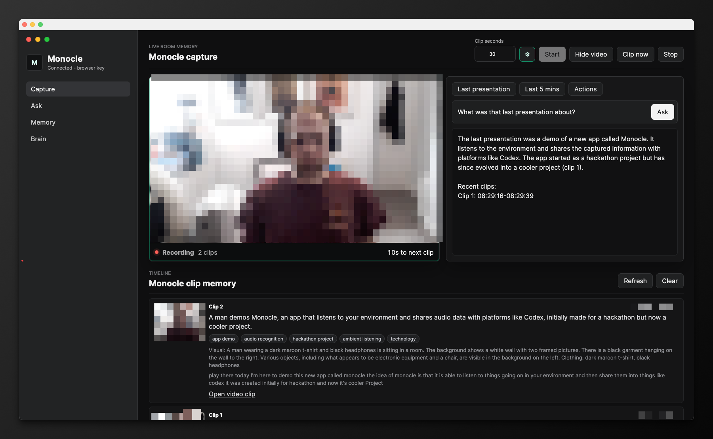
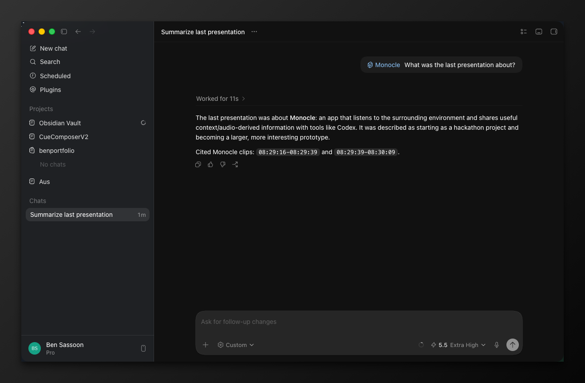

# Monocle

Hackathon POC for continuous webcam/microphone room memory. The app records short overlapping clips, extracts audio and visual summaries, and lets Codex query recent room context through the local Monocle bridge.



## Setup

```bash
npm install
cp .env.example .env
npm start
```

Then open `http://localhost:5177`.

You can set `OPENAI_API_KEY` in `.env`, or use the settings cog in the app to save a browser-local key.

## Codex skill setup

This repo includes a Codex skill template at `codex/skills/monocle` so Codex can answer `/monocle` questions from the local recorder.



From this repository root, install or refresh the skill:

```bash
mkdir -p ~/.codex/skills/monocle
REPO_PATH="$(pwd)"
sed "s|__MONOCLE_REPO__|$REPO_PATH|g" codex/skills/monocle/SKILL.md > ~/.codex/skills/monocle/SKILL.md
cp -R codex/skills/monocle/agents ~/.codex/skills/monocle/
```

Restart Codex so it reloads local skills. Then ask Codex with:

```text
/monocle what was the latest presentation about?
```

The skill runs `npm run ask:monocle` against this checkout and uses the recorder at `http://localhost:5177`. Keep the Monocle server running and the browser recorder active when you want fresh room memory.

## Notes

- Requires `ffmpeg` on the local machine for audio and frame extraction.
- `.env`, generated clips, extracted audio, frames, metadata, and memory logs are intentionally ignored.
- Codex bridge:

```bash
npm run ask:monocle -- "/monocle what was the latest presentation about"
```
